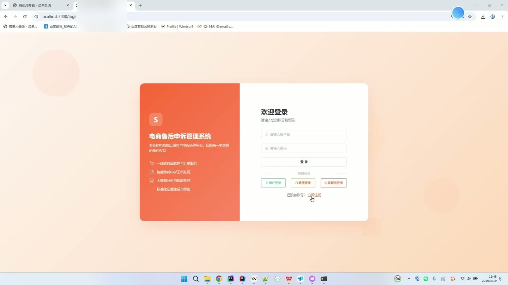
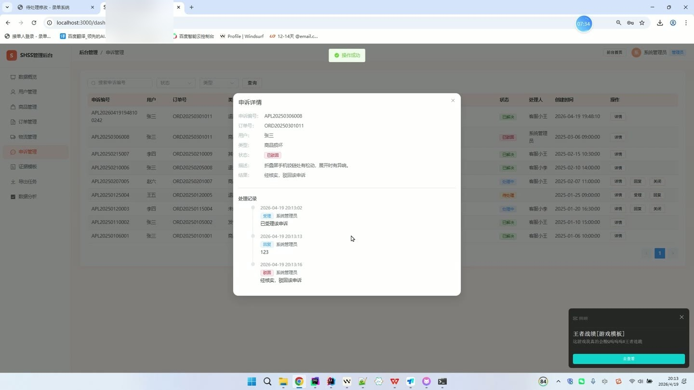
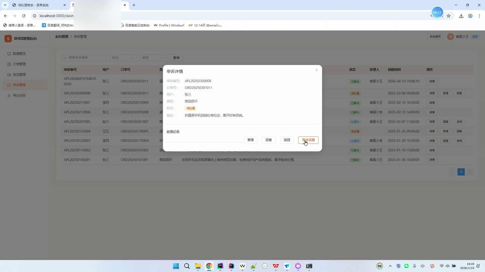
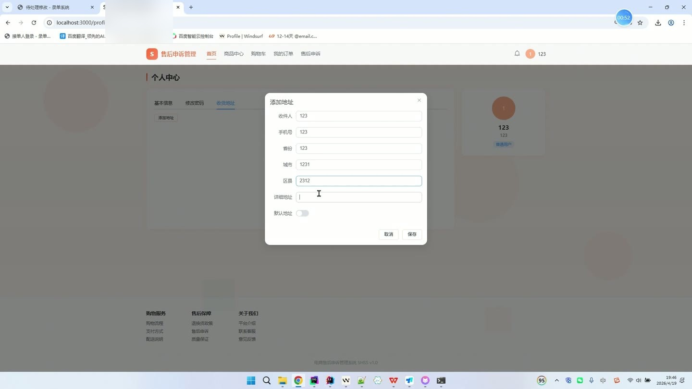

# (附文档)Python+Django+Vue3 电商售后申诉管理系统

**技术栈**：Python、Django、机器学习、Vue3、MySQL

### 系统简介

本系统是一套基于 Python + Django + Vue3 的电商售后申诉管理平台，采用前后端分离架构，后端提供 REST 接口，前端使用 Vue3 单页应用。系统包含普通用户、客服、管理员三类角色，围绕商品浏览、下单支付、物流跟踪、售后申诉、证据模板、导出任务与数据分析形成完整闭环。
 
### 核心功能
 
### 普通用户端

 
- 注册与登录：提交用户名、密码、邮箱、手机号、昵称完成注册，登录成功后返回 token 与用户信息。 
- 个人资料维护：修改昵称、邮箱、手机号、头像，并支持上传头像文件生成访问地址。 
- 修改密码：校验原密码后设置新密码，原密码错误时返回提示。 
- 收货地址管理：新增、编辑、删除收货地址，设置默认地址时自动取消其他默认项。 
- 消息中心：按类型筛选系统、订单、物流、申诉消息，支持单条标记已读与一键全部已读。 
- 商品浏览：按关键词、分类、价格区间筛选商品，支持按价格升降序、销量、最新排序与分页。 
- 商品详情与评价：查看商品主图、多图、简介、详情，查看评价列表并提交评分、内容与图片。 
- 购物车操作：加入购物车、修改数量、删除单项、清空购物车，重复加入同一商品自动累加数量。 
- 下单与支付：选择商品与收货地址创建订单，校验库存并扣减库存、增加销量，支持在线支付并记录支付时间。 
- 订单全流程操作：查看订单列表与详情、取消待支付或已支付订单、确认收货、完成订单，取消时回滚库存与销量。 
- 物流查看：按订单查询物流公司、运单号、物流状态与轨迹记录。 
- 售后申诉：对订单发起退款、退货、商品损坏、发错商品、未收到货等类型申诉，填写描述并上传证据图片。 
- 申诉进度跟踪：查看本人申诉列表与详情，接收客服处理进展通知消息。 
- 个性化推荐：获取基于机器学习生成的商品推荐列表与推荐理由。
 
### 客服端

 
- 数据概览：查看用户数、订单数、申诉数、在售商品数、待处理与处理中申诉数、今日订单数与总营收。 
- 用户查询：按关键词、角色、状态筛选用户列表，支持分页查看。 
- 订单管理：按订单号关键词与状态筛选全部订单，查看订单详情与商品明细。 
- 订单发货：对已支付订单录入物流公司与运单号完成发货，自动生成物流记录与揽收轨迹并通知用户。 
- 物流管理：按运单号关键词与物流状态筛选物流列表，新增物流轨迹描述与位置，更新物流状态并在签收时记录签收时间。 
- 申诉处理：按状态、类型、申诉编号筛选申诉列表，执行受理、驳回、介入、回复、关闭操作并写入处理记录。 
- 处理通知：每次处理申诉后自动向申诉用户发送申诉进展消息。 
- 证据生成：选择证据模板与申诉单，自动汇总订单号、运单号、物流公司、签收时间、收件人信息等生成证据数据。 
- 导出任务：创建证据导出任务、查看本人任务列表、对失败任务重试、下载已完成的 ZIP 证据包。 
- 分析结果查看：查看订单趋势、申诉统计、热门商品、用户行为等分析结果。
 
### 管理员端

 
- 用户管理：按关键词、角色、状态筛选用户，编辑昵称、邮箱、手机号、角色与状态，删除用户。 
- 员工创建：创建客服或管理员账号，设置用户名、密码、昵称、邮箱与手机号。 
- 商品管理：按关键词、分类、状态筛选商品，新增与编辑商品名称、分类、价格、原价、库存、主图、简介、详情与状态，删除商品。 
- 商品图片维护：新增商品时批量写入商品多图并按顺序排序，支持上传商品图片文件。 
- 分类管理：新增、编辑、删除商品分类，维护父分类、图标与排序值。 
- 申诉全局管理：查看全部申诉列表与详情，执行受理、驳回、介入、回复、关闭等处理动作。 
- 证据模板管理：新增、编辑、删除证据模板，维护模板名称、类型、字段配置、描述与启用状态。 
- 导出任务管理：查看全部导出任务，删除导出任务，重试失败任务并下载证据包。 
- 数据分析：一键运行全部分析或单独运行订单趋势、申诉统计、热门商品、用户行为分析任务。 
- 推荐刷新：触发全量用户商品推荐结果重新计算。
 
### 技术栈

 后端框架Python + Django + Django REST Framework ORMDjango ORM（Models 定义 user、order_info、appeal、product 等表） 权限与鉴权自定义 Token 鉴权，基于 role 区分 user / customer_service / admin 数据分析与推荐Spark 分析任务 + Python 回退计算，机器学习推荐模块 前端框架Vue3 + Vue Router UI 组件库Element Plus 状态管理Pinia（useUserStore） 构建工具Vite 图表可视化ECharts 数据库MySQL
 
### 交付内容

 
- 后端完整源码 
- 前端完整源码 
- 数据库初始化脚本 
- 万字文档

## 界面展示

---

## 获取完整源码 + 万字文档

本仓库为项目介绍页。**完整前后端源码、数据库初始化脚本、万字项目文档**，请加微信 `kangkangcode`，或访问 [codekk.top](http://codekk.top) 获取。

可作课程设计 / 毕业设计参考，支持远程部署调试。